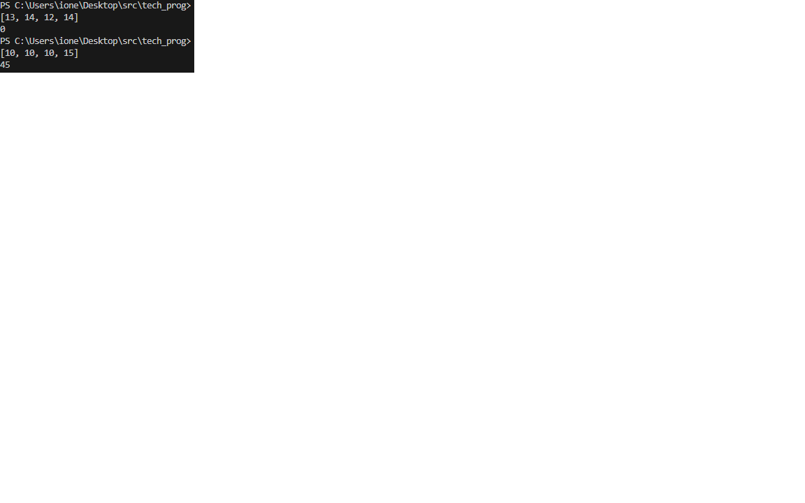

# Лабораторная работа № 1 - РАБОТА В IDLE. ИСПОЛЬЗОВАНИЕ АРИФМЕТИЧЕСКИХ ОПЕРАЦИЙ. СОЗДАНИЕ СПИСКОВ И СЛОВАРЕЙ. РАБОТА С ЦИКЛАМИ

Написать функцию, которая принимает целочисленный
список, состоящий из n элементов, и возвращает сумму элементов списка. Однако стоит исключить из подсчета число 13 и
числа, которые следуют после него. Например, для входящего
списка _{1,2,3,13,4}_ сумма будет равна 6.

[Код программы](main.py)

Примеры выполнения:

