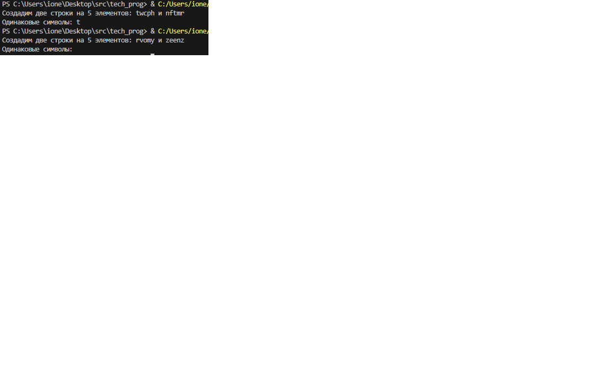

# Лабораторная работа № 2. РАБОТА С ОСНОВНЫМИ ВСТРОЕННЫМИ ФУНКЦИЯМИ

Написать функцию, которая принимает на вход две
разных строки и возвращает количество совпадений двух символов в строках. Например, на входе две строки «xadasw» и
«xad» совпадением будет считаться группа символов «xa» и
«ad».

[Код приложения](main.py)

### Пример работы приложения
