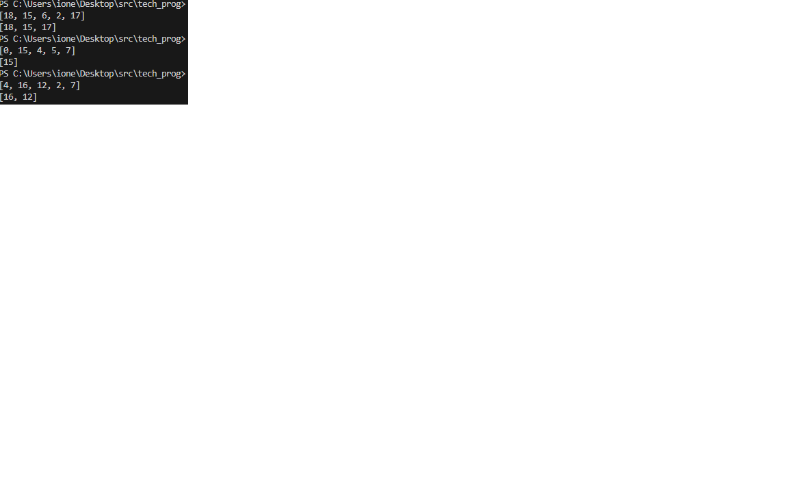

# Лабораторная работа №3 РАБОТА С ИТЕРАТОРАМИ, ГЕНЕРАТОРАМИ. РАБОТА С ГЕНЕРАТОРНЫМИ ВЫРАЖЕНИЯМИ

Написать функцию, которая принимает список, состоящий из n элементов, и целое число x и с помощью генераторной функции выводит на консоль только те элементы входящего списка, которые больше числа x.

[Код программы](main.py)

### Результат работы

