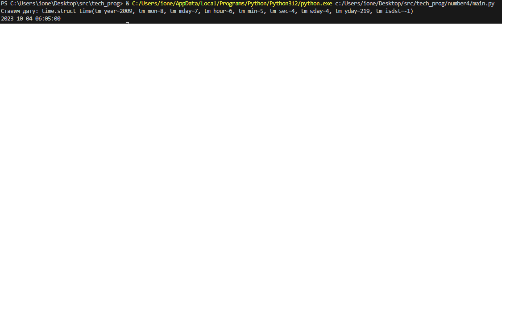

# Лабораторная работа №4 РАБОТА С ОСНОВНЫМИ МОДУЛЯМИ

Написать функцию, которая принимает строку, содержащую GMT, и возвращает смешенное значение текущей даты
и времени.

[Код приложения](main.py)

### Результат работы

