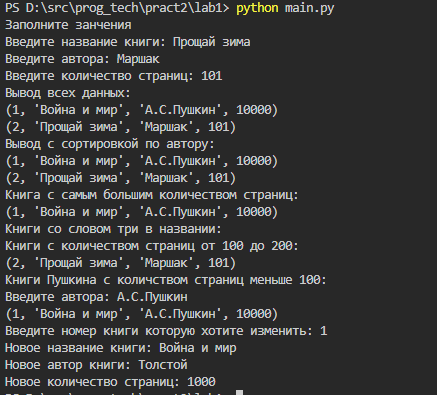
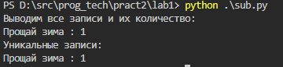
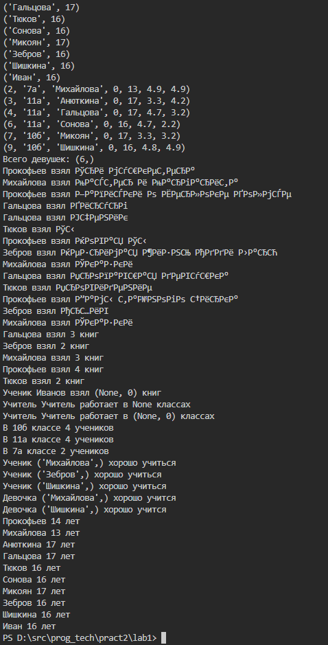

# Практикум 1. SQLite

### Задание:

_Задание 1_

Создайте базу данных Books.  В базе данных создайте таблицу информации о книге (номер, название, автор, количество страниц). Заполните информацию двумя способами: через команды кода и через ввод данных пользователем.  Просмотрите результат (все данные в базе). Отсортируйте все данные по автору. Найдите книгу с самым большим количеством страниц. Найдите все книги в названии которых есть слово - три. Найдите  книги с количеством страниц от 100 до 200. Найдите книги А.С. Пушкина с количеством страниц меньше 100. Найдите все книги определенного автора (запрос пользователя). Измените информацию о определенной книге (запрос пользователя, поиск по номеру). Удалите информацию о определенной книге (запрос пользователя).

_Задание 2_

Написать функцию, которая принимает наименование таблицы, имя поля и возвращает все записи и их количество по полученному полю из указанной таблицы. Находит дополнительно: уникальные записи  и количество уникальных записей.

_Задание 3_

Создайте базу данных образовательного учреждения  в SQLite. 
Таблицы (Проверьте числовые поля оценок из students на корректный ввод диапазона данных, пол - 0 или 1):

1. students - Список учащихся класса (номер* ** , класс, ФИО*, пол (значение по умолчанию 0), возраст, средняя оценка по математике, средняя оценка по географии)
2. bibl - Данные по взятым книгам в библиотеке (номер учащ.* ***. название книги, автор)
3. teachers -Данные по учителям (номер_записи* ** (автоинкремент) , ФИО*, класс, дисциплина)

*обязательное поле
** первичный ключ
*** внешний ключ

1. Проверьте создались ли таблицы (PRAGMA table_info(bibl))

2. Введите данные в таблицу students, объясните полученный результат (ввод данных в конструкции try ... except):
2.1 Ввод через переменные (все данные)
    a = (20, "7а", "Прокофьев", 1, 14, 3.4, 4.8)
    b = (21, "7а", "Кировкина", 0, 13, 5.9, 4.9)
2.2. Ввод через переменные  (данные без информации о поле)
    c = (24, "7а", "Михайлова", 13, 4.9, 4.9)
2.3. Какие проблемы возникнут при вводе следующих данных:
    d = (25, "7а", "Кировкина", 6, 13, 4.4, 4.2)
    e = (25, "7а", "Сомов", 1, 0, 4.1, 4.1)
3. Загрузите информацию из приложенных текстовых файлов.
4. Запросы (в гибкой форме):
5. Заполнение данных в таблицы (ведите нового студента в 10а)
6. Исправление данных в таблицах (измените класс с 10а на 11а во всех таблицах)
7. Удаление данных из таблиц (удалите учителя Боярин)
8. Поиск информации (о ученике, о том какие книги ученик взял в библиотеке, в каких классах преподает учитель)
9. Выведите на экран записи о всех учениках
10. Вывести записи о имени и возрасте учеников
11. Вывести информацию о девушках
12. Подсчитать количество девушек
13. Вывести информацию о  том какие книги взял ученик в библиотеке
14. Определить сколько книг взял каждый ученик в библиотеке
15. Создать запрос о том сколько книг взял конкретный ученик.
16. Создать запрос о том в каких классах преподает конкретный учитель.
17. Создать запрос о том в скольких классах преподает конкретный учитель .
18. Вывести список учеников конкретного учителя.
19. Определить количество учеников в классах.
20. Отбор хорошистов и отличников
21. Отбор девушек отличниц
22. Отбор детей определенного возраста.
23. Добавьте информацию в bibl. Ученик под номером 51, взял книгу Понкратова "История". Объясните результат.
24. Удалите студента Иванова. Объясните результат.
25. В таблицу bibl добавьте столбец "Статус" (0-на руках, 1 - вернул). Для всех записей выставите статус - на руках.

### Результат:

[Код первого задания](main.py)

[Код второго задания](sub.py)

[Код третьего задания](sub2.py)

