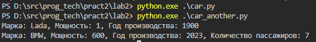
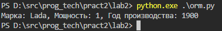
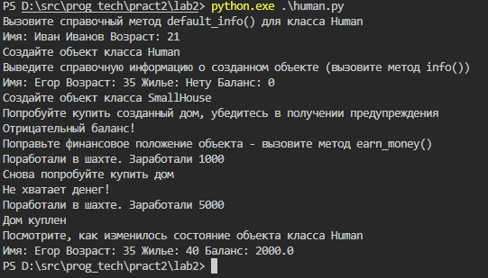

# Практикум 2. ООП

### Задание:

_Задание 1_

Создать класс Car с полями марка, мощность, год производства. Добавить конструктор класса. Создать производный от Car класс PassengerCar. Новые поля: количество пассажиров, ремонтная книжка (словарь вида запчасти: год замены). Определить конструктор, с вызовом родительского конструктора. Определить функции добавления замененной запчасти в ремонтную книжку, получения год замены по названию, форматированной печати всей ремонтной книжки. Переопределить метод преобразования в строку для печати основной информации (марка, мощность, год производства, количество пассажиров).

_Задание 2_

Создать заполненные экземпляры реализованных класса, сериализовать их. В другом Python-файле импортировать файл с описанием класса и десериализовать объекты. Применить к десериализованным объектам различные методы

_Задание 3_

Написать класс ORMMapper, который в конструкторе принимает имя другого существующего класса, который содержит только поля и с помощью метода convert_to_db() создает на основе структуры полученного класса таблицу в базе данных.

_Задание 4_

1. Создайте класс Human.
2. Определите для него два статических поля: default_name и default_age.
3. Создайте метод __init__(), который помимо self принимает еще два параметра: name и age. Для этих параметров задайте значения по умолчанию, используя свойства default_name и default_age. В методе __init__() определите четыре свойства: Публичные - name и age. Приватные - money и house.
4. Реализуйте справочный метод info(), который будет выводить поля name, age, house и money.
5. Реализуйте справочный статический метод default_info(), который будет выводить статические поля default_name и default_age.
6. Реализуйте приватный метод make_deal(), который будет отвечать за техническую реализацию покупки дома: уменьшать количество денег на счету и присваивать ссылку на только что купленный дом. В качестве аргументов данный метод принимает объект дома и его цену.
7. Реализуйте метод earn_money(), увеличивающий значение свойства money.
8. Реализуйте метод buy_house(), который будет проверять, что у человека достаточно денег для покупки, и совершать сделку. Если денег слишком мало - нужно вывести предупреждение в консоль. Параметры метода: ссылка на дом и размер скидки
9. Создайте класс House
10. Создайте метод __init__() и определите внутри него два динамических свойства: _area и _price. Свои начальные значения они получают из параметров метода __init__()
11. Создайте метод final_price(), который принимает в качестве параметра размер скидки и возвращает цену с учетом данной скидки.
12. Создайте класс SmallHouse, унаследовав его функционал от класса House
13. Внутри класса SmallHouse переопределите метод __init__() так, чтобы он создавал объект с площадью 40м2 (по умолчанию)
14. Тесты
15. Вызовите справочный метод default_info() для класса Human
16. Создайте объект класса Human
17. Выведите справочную информацию о созданном объекте (вызовите метод info()).
18. Создайте объект класса SmallHouse
19. Попробуйте купить созданный дом, убедитесь в получении предупреждения.
20. Поправьте финансовое положение объекта - вызовите метод earn_money()
21. Снова попробуйте купить дом
22. Посмотрите, как изменилось состояние объекта класса Human

### Результат:

[Класс машина](car.py)

[Десереализация класса машины](car_another.py)

[Класс ORM](orm.py)

[Класс человек и дома](human.py)

