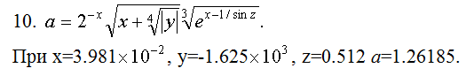
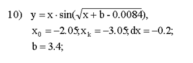
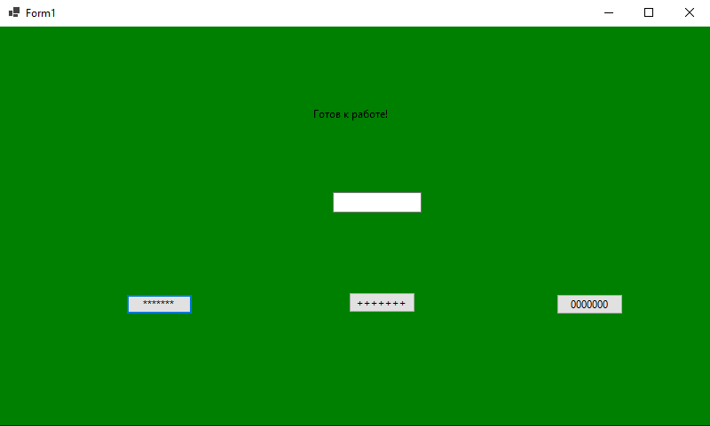
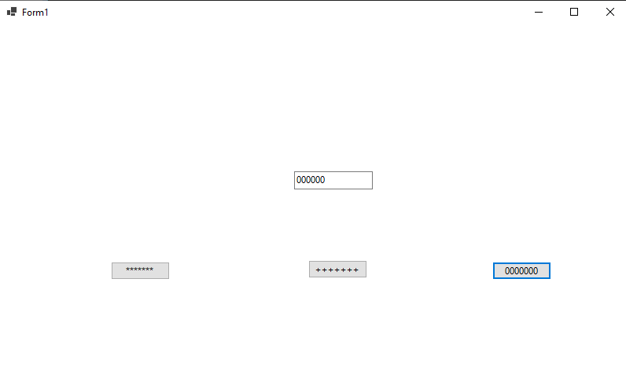
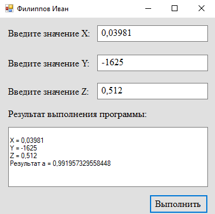
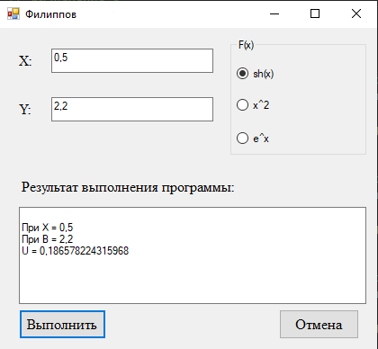
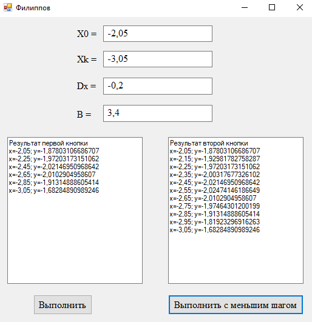

# Лабораторная работа 1. Визуальное проектирование В С#

### Задание:

_Задание 1_

Разместите на форме три кнопки (Button) и одно поле ввода (TextBox). Сделайте на кнопках следующие надписи: *****, +++++, 00000. Создайте обработчики события нажатия на данные кнопки, которые будут выводить текст, написанный на кнопках, в поле ввода. Создайте обработчик события создания формы (Load), который будет устанавливать цвет формы и менять текст в поле ввода на строку «Готов к работе». 

_Задание 2_

_Задание 3_

Cоставить программу для табулирования функции y(x), вывести на экран значения x и y(x). Добавьте вторую кнопку, которая будет вызывать ту же процедуру которую выполняет основная кнопка (но шаг при этом уменьшается в два раза). Две кнопки должны вызывать один и тот же метод.

### Результат:

