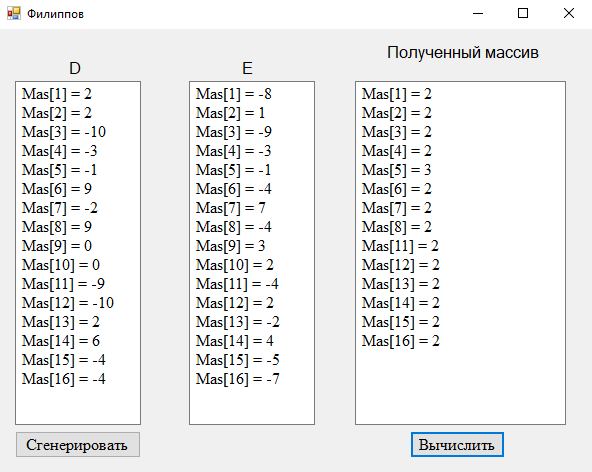

# Лабораторная работа 2. Строки массивы базы данных

### Задание:

_Задание 1_

Дана строка символов, состоящая из произвольного текста на английском языке, слова разделены пробелами. Удалить первую букву в каждом слове.

_Задание 2_

Заданы массивы D и E. Вычислить и вывести значения fi=(2*di+sin(ei)) / di, где i=1,2,…,16; вывести  1 < fi < 3.

_Задание 3_

Вычислить сумму S элементов главной диагонали матрицы B(10,10). Если S > 10, то исходную матрицу преобразовать по формуле bij = bij + 13.5;  если S <= 10, то  bij = bij^2 - 1.5. Вывести сумму S и преобразованную матрицу.

### Результат:

_Задание 1_

_Задание 2_

_Задание 3_

