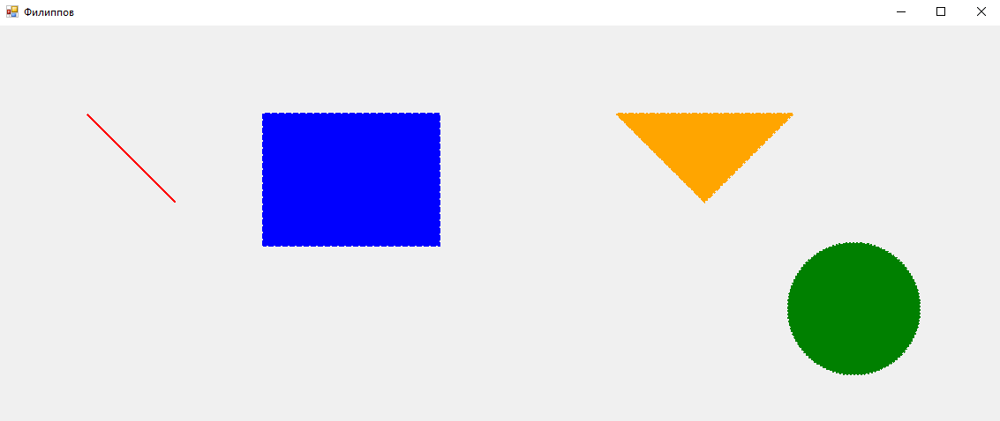
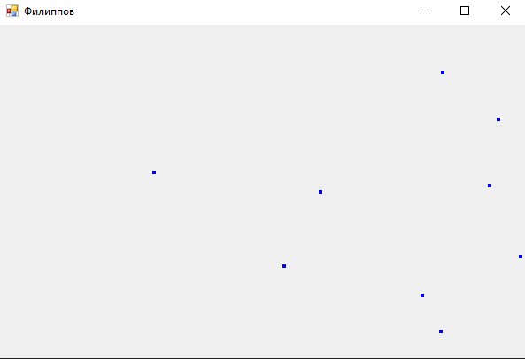
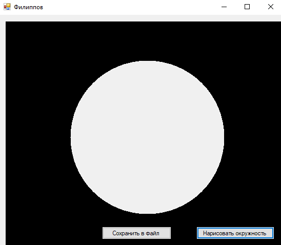

# Лабораторная работа №3. Графические примитивы

### Задание:

_Задание 1_

Создайте собственное приложение выводящий на форму рисунок, состоящий из различных объектов (линий, многоугольников, эллипсов, прямоугольников и пр.), не закрашенных и закрашенных полностью. Используйте разные цвета и стили линий (сплошные, штриховые, штрих-пунктирные). Пользователь может по нажатию клавиш перемещать его по экрану, менять его размер и поворачивать

_Задание 2_

Cоздайте программу, показывающую падение нескольких звезд одновременно.

_Задание 3_

Создайте функцию, выводящую на изображение окружность. Центр окружности совпадает с центром изображения. Все точки вне окружности закрашиваются черным цветом. Все точки внутри окружности остаются неизменными. Радиус окружности задается пользователем.

### Результат:

_Задание 1_

_Задание 2_

_Задание 3_

