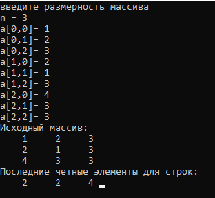

# Лабораторная работа №4. Методы расширения. Динамические библиотеки. Решение задач с массивами.

### Задание:

_Задание 2_

Для каждой строки найти последний четный элемент и записать данные в новый массив.

### Результат:

_Задание 2_

